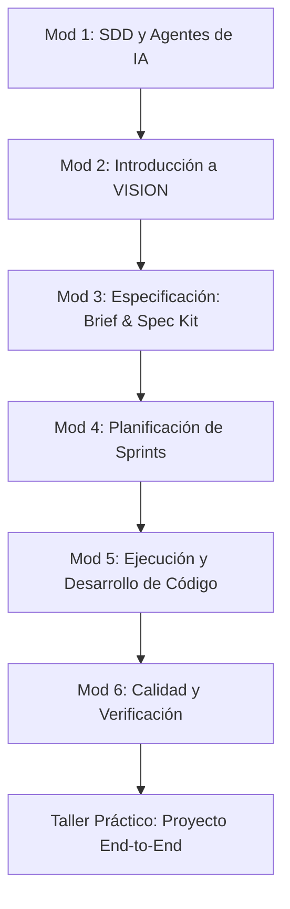

# 🎓 Curso de Capacitación: Desarrollo de Software Asistido por Agentes con VISION Framework

Este plan de capacitación está diseñado para transformar equipos de desarrollo tradicionales en **equipos de alto rendimiento asistidos por agentes de Inteligencia Artificial (IA)**. El curso enseña a utilizar el **VISION Framework** como mecanismo estructurado de **Spec-Driven Development (SDD)**, asegurando que la IA actúe como un copiloto predecible, ordenado y alineado con los objetivos de negocio y arquitectura.

---

## 🎯 Información General del Curso

*   **Público Objetivo**: Desarrolladores de Software (Frontend/Backend/Fullstack), Arquitectos de Software, Líderes Técnicos (Tech Leads), Aseguradores de Calidad (QA) y Product Owners / Project Managers.
*   **Formato**: Teórico-Práctico (Workshop / Hands-on).
*   **Duración Estimada**: 12 horas (distribuidas en 4 sesiones de 3 horas).
*   **Prerrequisitos**: 
    *   Experiencia básica en desarrollo de software y control de versiones (Git).
    *   Familiaridad con IDEs modernos (Cursor, VS Code, Claude Code).
    *   Node.js instalado localmente en sus estaciones de trabajo.

---

## 🗺️ Mapa de Ruta del Aprendizaje

---

## 📚 Estructura de Módulos

### 🧠 Módulo 1: El Cambio de Paradigma: Spec-Driven Development (SDD) & Agentes
**Objetivo**: Entender por qué escribir código directamente con IA sin especificaciones previas suele fallar a escala, y cómo los agentes cambian la interacción hombre-máquina.

*   **1.1. De Prompting Ad-Hoc a SDD**:
    *   Por qué el enfoque de *"escríbeme una función X"* produce deuda técnica.
    *   ¿Qué es Spec-Driven Development (Desarrollo Guiado por Especificaciones)?
    *   El ciclo de oro: **Input Claro ➔ Especificación Técnica ➔ Plan de Tareas ➔ Implementación de Código**.
*   **1.2. El ecosistema de Agentes de IDE**:
    *   Diferencia entre chats autocompletadores (Copilot tradicional) y Agentes Autónomos (Antigravity, Claude Code, Cursor Composer).
    *   Capacidades del agente: lectura del filesystem, ejecución de comandos, búsqueda semántica y edición no contigua de archivos.
*   **1.3. Patrones de Comunicación con Agentes**:
    *   Inyección de contexto eficiente (uso de `@file`, `@folder`, `@codebases`).
    *   El concepto de *"Prompts como Contratos"*.

---

### 📦 Módulo 2: Introducción a VISION Framework y su Arquitectura
**Objetivo**: Comprender la estructura de directorios, la filosofía de trabajo local-first y la máquina de estados de VISION.

*   **2.1. Filosofía de VISION**:
    *   **Local-first**: Trabajo descentralizado en la máquina del desarrollador.
    *   **Estructurado y Secuencial**: Cada fase tiene precondiciones y entregables verificables.
    *   **Especialización por Roles**: Uso del ecosistema de *Agency Agents*.
*   **2.2. Anatomía de un Proyecto VISION**:
    *   `refdocs/`: La fuente única de la verdad de negocio.
    *   `spec-kit/`: El corazón de la especificación técnica.
    *   `planning/`: El tablero de control y rastreador de sprints.
    *   `agency-agents/`: El catálogo de personalidades del agente del IDE.
*   **2.3. El Cerebro: `planning/workflow-state.json`**:
    *   Entender los estados del workflow (`created`, `brief_generated`, `spec_generated`, `sprints_generated`, `sprint_active`).
    *   Por qué no se debe editar a mano y cómo los scripts controlan las transiciones.

---

### 📐 Módulo 3: Fase de Especificación: Creando la Base de Ingeniería (Fases 1 a 3)
**Objetivo**: Aprender a estructurar requerimientos iniciales y convertirlos en especificaciones técnicas de alta fidelidad asistidos por el agente.

*   **3.1. Preparación de Entradas (`refdocs/`)**:
    *   La regla de oro: *"Basura entra, basura sale"*. Cómo inyectar mockups, diagramas, actas de reuniones y PDFs en `refdocs/`.
    *   *Reverse Engineering*: Configuración de VISION cuando el proyecto parte de una base de código existente (`source-code/`).
*   **3.2. Inicialización y Gestión del Brief**:
    *   Ejecución del comando `init` y toma de decisiones iniciales.
    *   El ciclo de clarificación: uso de `clarify_brief` para resolver ambigüedades antes de escribir.
    *   Generación de `spec-kit/input/brief.md` mediante `generate_brief`.
*   **3.3. Creación del Spec Kit (Los 8 Artefactos)**:
    *   Ejecución de `generate_spec_kit`.
    *   Análisis detallado de los 8 documentos generados obligatoriamente:
        1.  **PRD.md**: Casos de uso y flujos.
        2.  **technical-spec.md**: Decisiones arquitectónicas.
        3.  **api-spec.yaml**: Especificación OpenAPI.
        4.  **data-model.md**: Entidades y esquemas de base de datos.
        5.  **epics.md**: Épicas del sistema.
        6.  **stories.md**: Historias de usuario detalladas con criterios de aceptación.
        7.  **sprint-plan.md**: Plan tentativo de entregas.
        8.  **test-plan.md**: Estrategia de pruebas por capa.
    *   *Revisión Humana*: El paso crítico de corrección del Spec Kit antes de avanzar.

---

### 🗓️ Módulo 4: Planificación de Sprints Guiada por Agentes (Fase 4)
**Objetivo**: Aprender cómo el framework y el agente automatizan el desglose de tareas, asignación de puntos e identificación de dependencias.

*   **4.1. Generación del Sprint Backlog**:
    *   Ejecución de `generate_sprints` y creación del directorio `planning/sprints/`.
    *   Estructura interna de un sprint en VISION:
        *   `sprint-goal.md` (El norte del sprint).
        *   `stories.md` (Historias asignadas).
        *   `tasks.md` (Lista estructurada de tareas con ID, Story, Owner Role, Status y Points).
        *   `qa-plan.md` (Checklist de validación).
*   **4.2. Mapeo de Roles y Asignación de Tareas**:
    *   Comprender el archivo `agent-roles.json`.
    *   Cómo las tareas se clasifican con owners específicos según el área técnica (`frontend`, `backend`, `qa`, `deploy`, `pm`).

---

### 🚀 Módulo 5: Ejecución y Desarrollo de Código en Sprints (Fase 5)
**Objetivo**: Dominar el flujo diario de codificación con el agente, respetando el contrato de ejecución de sprints y los roles declarados.

*   **5.1. El Comando `start_sprint --sprint N`**:
    *   Activación del sprint a nivel de sistema.
    *   **El Contrato de Codificación**: Por qué el agente debe implementar código funcional *en la misma sesión* del comando y no solo limitarse a dar explicaciones o resúmenes.
*   **5.2. Declaración Obligatoria de Agente**:
    *   La norma transversal de declarar roles al inicio del mensaje del agente: `**Agente(s):** [roles]`.
    *   Simular el rol correcto de Agency Agents según la tarea en desarrollo (ej: `engineering-backend-architect` para endpoints, `design-ui-designer` + `engineering-frontend-developer` para maquetación).
*   **5.3. Desarrollo Continuo y Resolución de Slices Verticales**:
    *   Uso de `continue_sprint` para retomar tareas pendientes.
    *   Desarrollo orientado a *slices verticales* (ej: endpoint base + base de datos + componente visual mínimo) para asegurar entregas rápidas y testeables.

---

### 🧪 Módulo 6: Puerta de Calidad, Verificación y Cierre
**Objetivo**: Entender cómo garantizar la calidad del software generado por IA antes de avanzar, y las reglas estrictas de transición entre sprints.

*   **6.1. Validación Contra el Plan de QA (`qa-plan.md`)**:
    *   Cómo opera el rol `testing-reality-checker` (Verificador de Realidad).
    *   Verificación automatizada de pruebas y cumplimiento de criterios de aceptación.
*   **6.2. Gestión de Tareas en `tasks.md`**:
    *   Actualizar el estatus de tareas a `done`.
    *   Regla de oro: **No se marcan tareas como done si no compilan, no pasan tests o no cumplen con la especificación**.
*   **6.3. Transición Estricta al Siguiente Sprint**:
    *   Por qué el comando `start_sprint --sprint N` (donde N > 1) requiere obligatoriamente que todas las tareas del sprint `N-1` estén en estado `done`.
    *   Cómo el sistema automatiza el cierre del sprint anterior y registra el nuevo estado del workflow.

---

## 🛠️ Taller Práctico (Hands-on Lab): Proyecto "TaskFlow API"

Los estudiantes construirán una aplicación de gestión de tareas colaborativa utilizando VISION Framework de principio a fin.

### Ejercicios Guiados:
1.  **Día 1**: Inicializar el proyecto con `init` y colocar las historias de usuario de TaskFlow en `refdocs/`.
2.  **Día 2**: Ejecutar `generate_brief` y `generate_spec_kit`. El equipo actuará como "Revisor de Arquitectura" para corregir y enriquecer la especificación técnica generada.
3.  **Día 3**: Ejecutar `generate_sprints`, analizar el backlog creado, y activar el Sprint 1 mediante `start_sprint --sprint 1`.
4.  **Día 4**: Desarrollar la funcionalidad (Modelos de base de datos y Endpoints CRUD) de TaskFlow. Utilizar el agente para escribir tests automatizados e implementarlos. Validar contra el plan de QA y cerrar el Sprint.

---

> [!IMPORTANT]
> **Recomendación para los Instructores**: Fomentar el uso de comandos de diagnóstico como `npm run status` y el Dashboard Web (`npm run status:web`) durante todo el curso. Esto ayuda a los equipos a visualizar en tiempo real cómo su trabajo local impacta el estado central del workflow y de la planificación.

> [!TIP]
> **Buenas Prácticas del Curso**: Se sugiere que cada estudiante practique actuando como el "Líder Técnico Humano" de su agente de IA, validando críticamente cada paso arquitectónico y línea de código escrita antes de dar su aprobación para continuar.
